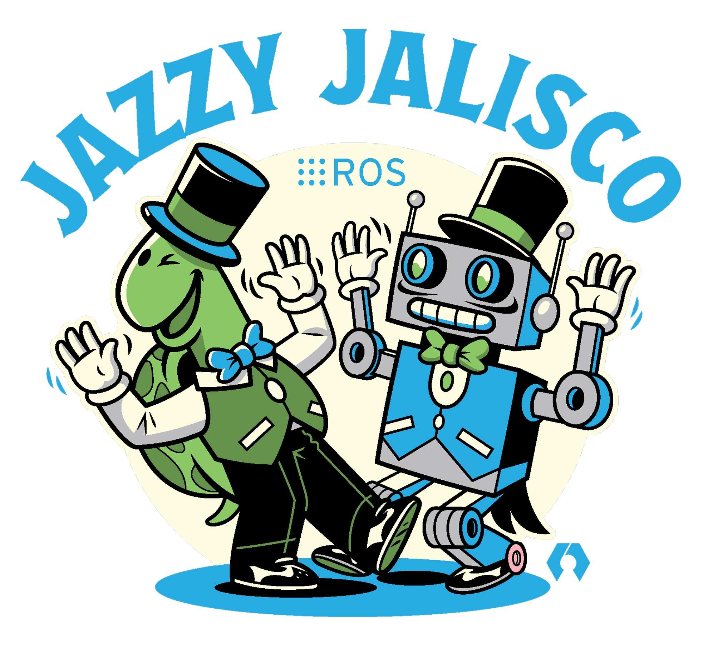

# Software Distributions

Distributions are collections of software that are pre-packaged to use as is. Each year, a new ROS2 distribution is released containing cummulative updates/changes packaged into an official release. ROS2 is primarilly supported on the flavor of Linux named Ubuntu, and each distribution of ROS2 is compatible with a specific Ubuntu distribution.

## ROS2 Jazzy Jalisco

ROS2 Jazzy, at the time of writing this, is the latest ROS2 long term support (LTS) distribution. ROS2 Jazzy has an end of life (EOL) of May 2029. This distro improves upon previous releases by revamping integrations with Gazebo and adding QoL improvements to publishing/subscribing.

## Ubuntu 24.04

Ubuntu 24.04 Noble Numbat is the Linux distribution compatible with ROS2 Jazzy. It runs on nearly all machines in the lab, including the ground control station (GCS) and all agents. The GCS integrates VICON localization with ROS2 and manages experiments.

